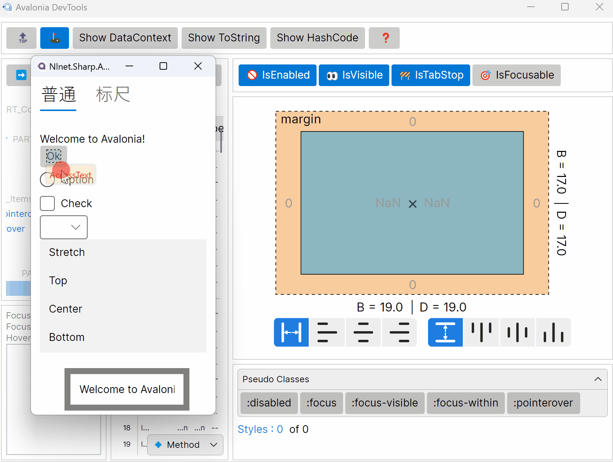
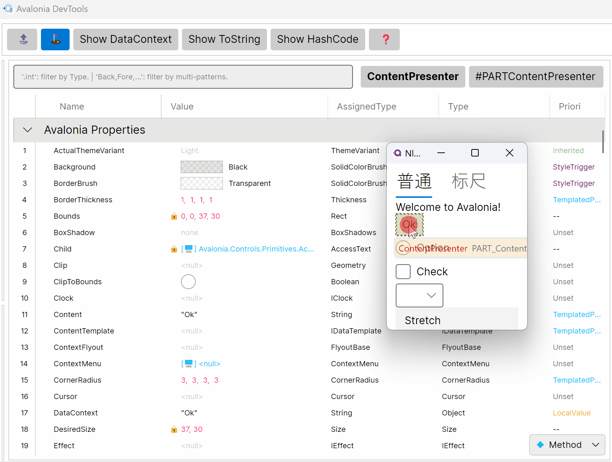

# About
This library provides an ability to generate icon classes from iconfont.json which comes from [https://www.iconfont.cn/](https://www.iconfont.cn/). Some other tools those can provides iconfont will be supported soon if you file an issue to us.

You can use it in avalonia (and wpf in future), in kinds of ways, just like this:
```xaml
<TextBlock Text="{Fruit Orange}" />
<TextBlock>
    <Run Text="{Fruit Apple}" FontFamily="{IconFamily Fruit}"/>
</TextBlock>
```

## Promotion


We have created a powerful DevTools for Avalonia. A free trial plan is available now. Visit our [website](https://www.devtools.nlnet.net) to learn more about it.






## Using

1. Create a standalone project for iconfont resources.

2. Add the package `Nlnet.Sharp.Iconfont.Generator` from Nuget.

3. Download an iconfont from [https://www.iconfont.cn/](https://www.iconfont.cn/) and you can have the two files of iconfont.json (or other name like *.json) and iconfont.ttf (or other name like *.ttf). Put them into the resource project.

   > Note that the *.ttf should be an Avalonia Resource.

4. Add the iconfont.json as AdditionalFiles and give it an IconName property.

   ```xml
   <ItemGroup>
       <AdditionalFiles Include="Assets\iconfont.json" IconName="Travel" />
   </ItemGroup>
   ```

That's all. Build your solution and you will get a set of classes for Travel, including:

* `TravelExtention`. This is a MarkupExtension.

* `TravelChars`. This is a static class that has all glyph chars as fields.

* `TravelInfo`. This is a static class that contains information about the iconfont.

* `TravelKeys`. This is an enum that has all glyph names as values.

Also you have two more classes for all iconfonts:

* `IconFamilyExtension`. This is a MarkupExtension to set iconfont FontFamily.
* `IconFamilyKeys`. This is an enum that contains all iconfont's names.

Some using examples:

```xaml
<TextBlock Text="{x:Static TravelChars.See}" FontFamily="{IconFamily Travel}" />
<TextBlock Text="{Travel Sea}" FontFamily="{IconFamily Travel}" />
<TextBlock Text="{Travel Sea}" />
<TextBlock Text="{Travel Sea, AutoSetFontFamily=true}" />
<TextBlock Text="{Travel Sea, Prefix='This text is before the icon sea.', Suffix='This text is after the icon sea.'}" />
```

## Options

We provide some MsBuild Properties to control the build-behaviors.

### IconNamespace

You can control the namespace of the classes related to the iconfont by setting IconNamespace. The default namespace of the project will be used if it is not set.

```xml
<AdditionalFiles Include="Assets\iconfont.json" IconName="Travel" 
                 IconNamespace="Nlnet.Sharp.Icon.Travel" />
```

### UseDefaultXmlnsPrefix

The xmlns prefix in xaml for the classes related to the iconfont can be saved by setting UseDefaultXmlnsPrefix to true. 

```xml
<AdditionalFiles Include="Assets\iconfont.json" IconName="Travel" IconNamespace="Nlnet.Sharp.Icon.Travel"
                 UseDefaultXmlnsPrefix="true" />
```

With this option being enabled, the namespace will be put into the avalonia's default XmlnsDefinition. Then you can use it like this:

```C#
<TextBlock Text="{Travel Sea}" FontFamily="{IconFamily Travel}"/>
```

### InjectFallbackFont

The FontFamily can be saved by setting InjectFallbackFont to true.

```xml
<AdditionalFiles Include="Assets\iconfont.json" IconName="Travel"
                 InjectFallbackFont="true" />
```

With this option being enabled, the font family of the iconfont will be put into the FontManager to be a fallback FontFamily. Note that only one iconfont can be built with this option.

```xaml
<TextBlock Text="{Travel Sea}" />
```

### AutoSetFontFamily

The FontFamily can be saved by setting AutoSetFontFamily to true. 

```xml
<AdditionalFiles Include="Assets\iconfont.json" IconName="Travel"
                 AutoSetFontFamily="true" />
```

Then the value of the TravelExtension's property AutoSetFontFamily will be true by default. The FontFamily will be auto set when TravelExtension is used in markup.

```xaml
<TextBlock Text="{Travel Sea}" />
```

Also, without setting MsBuild property AutoSetFontFamily, you can just set the property when you use the TravelExtension like this:

```xaml
<TextBlock Text="{Travel Sea, AutoSetFontFamily=True}" />
```

### ConsiderIIconVisualWhenAutoSetFontFamily

If the AutoSetFontFamily is true, the iconfont FontFamily will be set to the control that used the TravelExtension, which means the whole text of the control will use the iconfont FontFamily. It is wrong.

```xaml
<SomeControl SomeProperty="{Travel Sea, Suffix='Text after the icon.'}" FontFamily="{IconFamily Travel}" />
```

The option ConsiderIIconVisualWhenAutoSetFontFamily provides a mechanism to do right thing. With that option, the TravelExtension will set `global:Nlnet.Sharp.IIconVisual.FontFamily` instead of the FontFamily of the Control.

So the SomeControl should implement the interface `IIconVisual`, which is:

```c#
public interface IIconVisual
{
    public string? Icon { get; set; }
    public double IconSize { get; set; }
    public IBrush? IconBrush { get; set; }
    public FontFamily? IconFamily { get; set; }  
}
```

